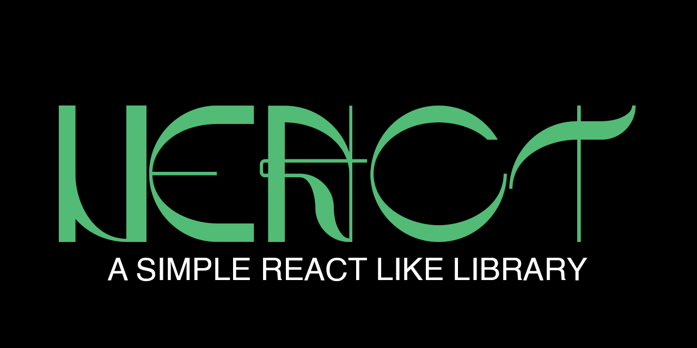

# NEACT (Neat-React)

A minimalistic React-like framework built with Vite and Babel to create web applications using a component-based architecture inspired by Preact.

## Features

-   **Reconciliation**: Efficiently updates the DOM by comparing the current state with the previous state.
-   **Component-Based**: Build reusable components with a simple API.
-   **State Management**: Manage component state with a straightforward approach.
-   **Event Handling**: Attach event listeners to components for user interactions.
-   **DOM Manipulation**: Directly manipulate the DOM with a virtual DOM diffing algorithm.
-   **Babel Transpilation**: Use modern JavaScript features and JSX syntax, transpiled by Babel for compatibility with older browsers.
-   **Vite Integration**: Leverage Vite for a fast development experience with features like hot module replacement and a development server.

## Usage

1. **Install Dependencies**: Run `npm install` to install all necessary dependencies.
2. **Build the Project**: Run `npx babel src --out-dir dist --extensions '.js'` to transpile the code.
3. **Start Development Server**: Use `vite` to start the development server.
4. **Preview the Build**: Run `vite preview` to preview the production build.
